# 1. 项目概述

**Everything ZK Verify** 是一个基于零知识证明（ZK）的隐私验证 + AI Agent 撮合 + 隐私支付平台。用户通过 ZK 电路验证个人属性（身份、体检、学历等）获得链上验证标签。每个用户拥有自己的 **Personal Agent**（负责对话分析、用户画像构建，后期可执行 DeFi 交互）和 **Agentic Wallet**（集成 OnchainOS，TEE 私钥托管）。**Platform Agent**（平台中立第三方）负责规则评估、证据收集、匹配协调和仲裁，确保公正性。**Agent 可控制 Agentic Wallet 发起链上操作，但私钥在 Wallet 的 TEE 内生成和签名，任何人无法触碰。**
**核心理念：** 证明你是谁，但不暴露你是谁。

# 2. 系统架构
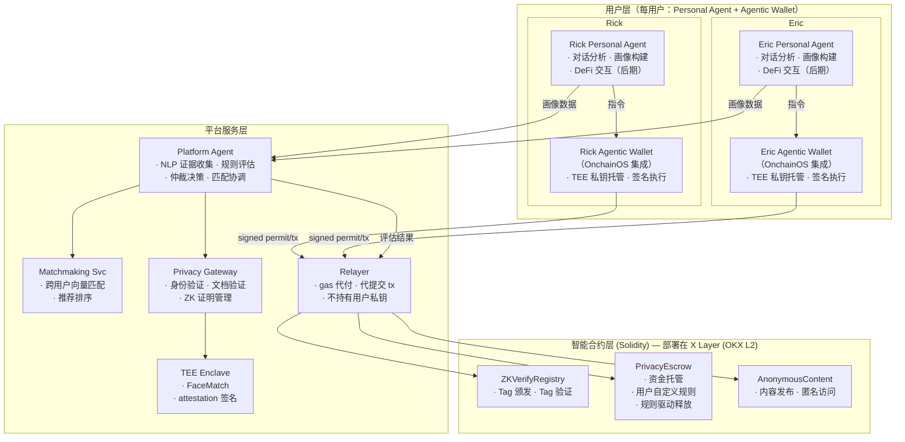

# 3. 核心模块设计

## 3.1 ZK 验证标签系统 (ZKVerifyRegistry)

**目标：** 让用户证明自己拥有某些属性，而不暴露属性的具体内容。
**流程（人脸类 → TEE attestation，文档/范围类 → ZK Proof）：**
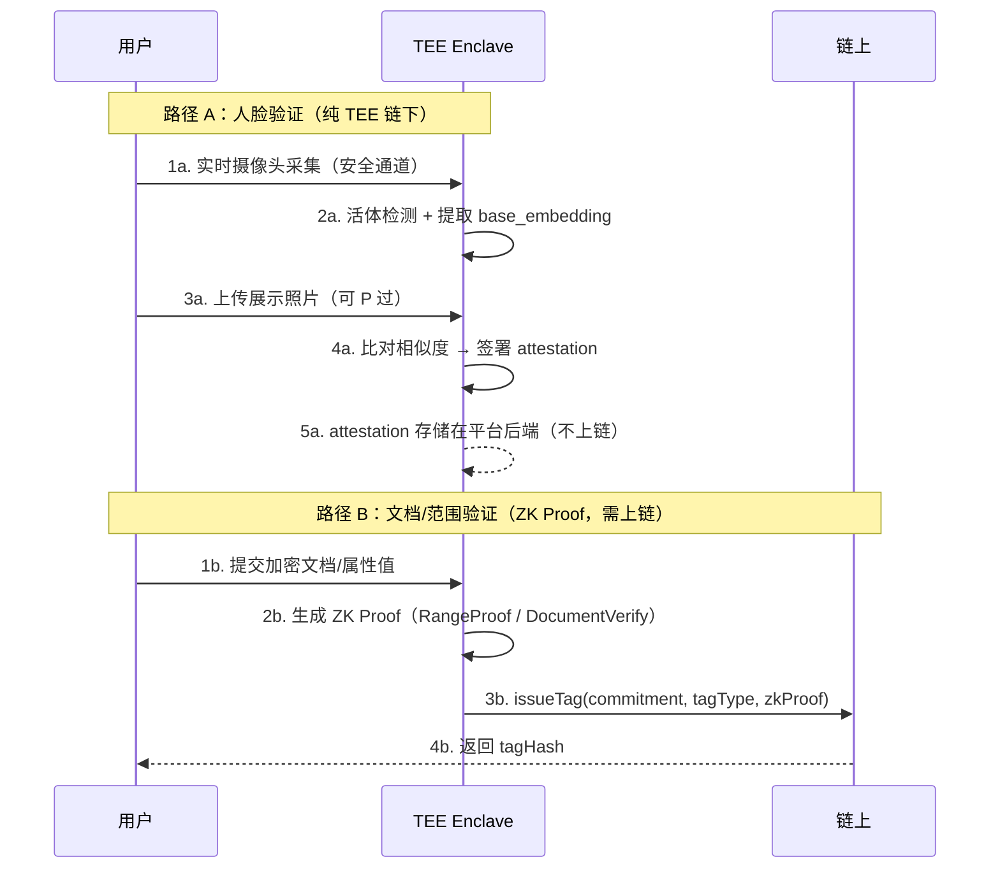

**支持的标签类型：**

| 标签 | 说明 | 验证方式 | 是否上链 |
|------|------|---------|---------|
| IDENTITY | 身份证明（活体检测） | TEE attestation | 否，纯链下 |
| PHOTO_AUTHENTICITY | 展示照片与真人匹配度 | TEE attestation | 否，纯链下，分数展示在 profile 上供浏览者参考 |
| HEALTH_REPORT | 体检报告验证 | ZK Proof (DocumentVerify) | 是 |
| AGE_RANGE | 年龄范围证明 (如 >18) | ZK Proof (RangeProof) | 是 |
| INCOME_RANGE | 收入范围证明 | ZK Proof (RangeProof) | 是 |
| EDUCATION | 学历验证 | ZK Proof (DocumentVerify) | 是 |
| SOCIAL_SCORE | 社交信用评分范围 | ZK Proof (RangeProof) | 是 |

**隐私保证：**

- 链上只存储 `commitment`（Poseidon hash），无法反推用户身份
- ZK Proof 证明属性有效性，但不泄露属性值
- 验证后原始文档立即销毁，不在任何地方留存

## 3.2 AI Agent 架构 & 撮合引擎

### Agent 架构 — Personal Agent + Platform Agent + Agentic Wallet + Relayer

系统采用**双层 Agent 架构**：每个用户拥有自己的 **Personal Agent** 和 **Agentic Wallet**；平台运行一个中立的 **Platform Agent** 负责规则评估、证据收集和仲裁。

- **Personal Agent（用户侧）：** 只负责对话分析、用户画像构建（embedding 生成）、偏好学习。后期账户有资金后可代理执行 DeFi 交互（如买 meme、swap 等）。**不参与规则评估和仲裁** — 避免"自己评判自己"的利益冲突。
- **Platform Agent（平台侧，中立第三方）：** 负责 NLP 证据收集（消息数、照片哈希、联系方式检测）、RuleSet 规则评估、仲裁决策、匹配协调。作为中立方确保公正性。
- **Agentic Wallet（用户侧，OnchainOS 提供）：** 私钥在 TEE 内生成和签名，任何人（包括 Agent、用户、平台）无法导出。集成 OnchainOS 的 Wallet / Trading / Market Data / Payments 四大能力，接收 Agent 指令执行签名和链上操作。
- **Relayer（平台侧）：** gas 代付 + 代提交 tx。

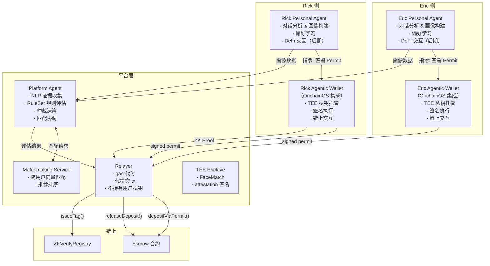

**四层角色分工：**

| 角色 | 职责 | 是否接触私钥 |
|------|------|------------|
| **Personal Agent** | 对话分析、用户画像构建（偏好学习、embedding 生成）。后期可代理 DeFi 操作（买 meme、swap 等）。**不参与规则评估和仲裁。** | ❌ 不接触 |
| **Platform Agent** | NLP 证据收集（消息数、照片哈希、联系方式检测）、RuleSet 规则评估、仲裁决策、匹配协调。中立第三方，解决"收款方 Agent 自己评判"的利益冲突。 | ❌ 不接触 |
| **Agentic Wallet** | TEE 内私钥管理（签名、授权）、集成 OnchainOS（Agent 注册、服务发现、跨平台交互）、接收 Agent 指令执行链上操作 | ✅ 私钥在 TEE 内，不可导出 |
| **Relayer** | 接收 Agentic Wallet 签好的交易，代付 gas 提交上链。只是签名的搬运工 — 无法伪造签名（签名绑定了用户地址和金额） | ❌ 不接触 |

**Agent ↔ Agentic Wallet 交互模式：**
```
Agent 决策: "Eric 点了感兴趣，需要支付 $0.50"
  → Agent 发送指令给 Agentic Wallet: signPermit({ token: USDC, amount: 0.50, spender: escrow })
  → Agentic Wallet 用私钥签名（私钥不出 TEE）
  → Agentic Wallet 将 signed permit 发送给 Relayer
  → Relayer 代提交 tx 上链（gas 代付）
```

**OnchainOS 集成：** Agentic Wallet 通过 OnchainOS 实现 Agent 身份注册、服务发现、跨平台互操作。其他 OnchainOS 平台的 Agent 可以通过标准接口与用户的 Agentic Wallet 交互（如 Agent-to-Agent 支付场景）。

**TEE 职责：** 处理敏感计算（FaceMatch、attestation 签名），Phase 2 后 Platform Agent 的核心逻辑也迁入 TEE。

**Personal Agent 后期 DeFi 能力：** 当用户 Agentic Wallet 中有资金时，Personal Agent 可代理执行简单 DeFi 操作（如买 meme coin、swap、流动性操作等），通过 Agentic Wallet 签名完成链上交互。这与平台业务（规则评估、仲裁）无关，是用户个人资产管理的延伸。

### 撮合引擎 (Matchmaking Service)

**目标：** 基于 ZK 验证标签 + 用户偏好 + AI 生成的用户画像，智能匹配用户。
**匹配信号来源：**
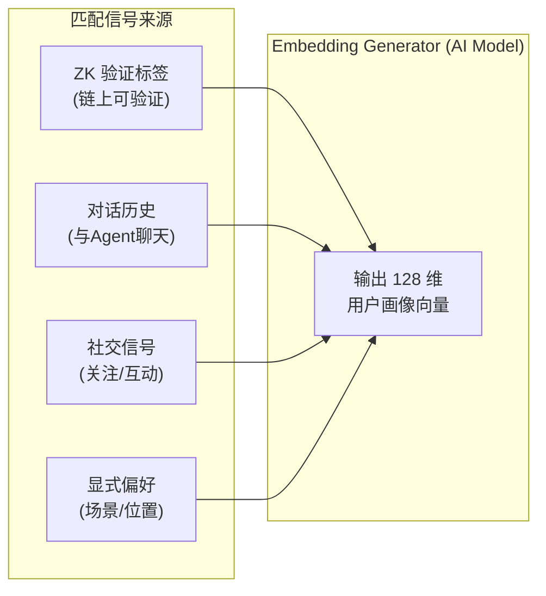

**匹配算法（四因子加权）：**

1. **标签过滤 (30%)** — 双方必要标签是否满足
2. **向量相似度 (30%)** — Cosine similarity of user embeddings
3. **偏好互补度 (15%)** — 场景、地理位置等显式偏好
4. **ERC-8004 信任分 (25%)** — 链上 P2P 互评聚合分（详见 §5.4）
5. **最低分数线** — 60 分以下不匹配

**场景支持：**

- `dating` — 交友匹配，支持 gate fee
- `ecommerce` — 电商信任匹配（买卖双方验证）
- `social` — 社交圈匹配
- `professional` — 专业人脉匹配

## 3.3 隐私支付 & 用户自定义仲裁系统 (PrivacyEscrow + Arbitration)

### 为什么仲裁标准需要用户定义？

不同场景对"有效交互"的定义完全不同：

| 场景 | 接收方想要什么 | 硬编码能支持吗 |
|------|--------------|---------------|
| 高端交友 | 至少聊10条 + 交换照片 + 视频通话5分钟 | ❌ |
| 普通聊天 | 聊3条就行 | ✅ |
| 线下约会 | 到餐厅签到 + 双方确认见过面 | ❌ |
| 付费咨询 | 提交咨询报告(内容交付) | ❌ |
| 家政/代驾 | 到客户家签到 + 服务完成确认 | ❌ |
| 健身教练 | 视频通话指导30分钟 | ❌ |

**新方案：** 接收方自己定义一组规则（RuleSet），付款方付款前可查看规则，**Platform Agent**（中立第三方）严格按规则自动评估，避免收款方自己评判自己的利益冲突。

### 规则类型清单

规则的核心目标：**判定交互是否"有效"**。gate fee 的本质是 Eric 为获得 Rick 的真诚互动而付费，因此规则要衡量的是 Rick 是否真的在认真交流。

| RuleType | paramUint 含义 | paramBytes 含义 | Agent 怎么评估 |
|----------|---------------|----------------|---------------|
| CONVERSATION | 最少消息数 (默认5) | — | 统计**双方各自**的消息数，双方都需达标 |
| MIN_RESPONSE_RATIO | 最低回复比例 (默认30，即30%) | — | `min(A消息数, B消息数) / max(A, B) >= ratio`，防单方刷消息 |
| CONTACT_SHARED | — | — | 接收方是否在对话中分享了联系方式（微信/手机/社交账号，Agent 通过 NLP 检测） |
| OFFLINE_AGREED | — | — | 双方是否在对话中达成了线下见面意向（Agent 通过 NLP 检测关键词：约、见面、地点、时间） |
| VIDEO_CALL | 最少时长 (秒) | — | 确认视频通话发生+时长 |
| PHOTO_EXCHANGE | — | — | 确认双方提交了照片哈希 |
| OFFLINE_CHECKIN | 停留时间 (秒) | 位置哈希 | 验证 GPS/NFC 签到 |
| CONTENT_DELIVERY | — | 内容哈希 (可选) | 确认提交了内容/文件 |
| SERVICE_COMPLETED | — | — | 双方签名确认 |
| CUSTOM_PROOF | — | 期望证明类型哈希 | 验证 zkProof 匹配 |

每条规则有 `required` 标志：`true` = 必须满足才释放资金，`false` = 加分项。

> **PHOTO_AUTHENTICITY 不是规则，是 profile 展示指标：** TEE attestation 中的相似度分数（如 0.82）直接展示在 Rick 的 profile 页面上（"照片真实度 82%"），Eric 自己看着决定是否感兴趣。它不参与 Escrow 规则评估 — 照片真不真是 Eric 付费前自己判断的事，不是 Agent 仲裁的事。

> **ZK 标签验证（体检报告、学历等）也不在 RuleSet 中：** 同理，这些是 profile 上的独立验证按钮（详见 §4.3），Eric 付费前自己点击验证，不参与 Escrow 规则评估。

> **什么算"有效交互"：** 核心思路是"Rick 有没有真的在跟 Eric 聊"。最基础的判定是双方消息数 + 回复比例（CONVERSATION + MIN_RESPONSE_RATIO），进阶判定是 Rick 是否愿意交换联系方式（CONTACT_SHARED）、是否约了线下（OFFLINE_AGREED）、是否视频过（VIDEO_CALL）。Rick 设 gate fee 时自己选择哪些规则 — 如果她设了 CONTACT_SHARED 就意味着她承诺聊得好会给联系方式。

> **防博弈说明：** CONVERSATION 规则强制双向校验 — "5 条消息"指双方各发至少 5 条，而非总数。CONTACT_SHARED 和 OFFLINE_AGREED 依赖 Platform Agent NLP 检测对话内容中的关键信号，Phase 3 将升级为 AI 对话质量评估（判断对话是否实质性，而非"嗯""哦""好的"灌水）。

### 规则组合示例
```typescript
// 场景 A：高端交友（Rick 承诺认真聊 + 给联系方式）
// 注：照片真实度、体检、学历等展示在 profile 上，不在 RuleSet 中
{
  description: '双方各聊10条 + 回复比例≥30% + 分享联系方式 + 交换照片，约线下/视频通话加分',
  rules: [
    { ruleType: CONVERSATION, paramUint: 10, required: true },
    { ruleType: MIN_RESPONSE_RATIO, paramUint: 30, required: true },
    { ruleType: CONTACT_SHARED, required: true },
    { ruleType: PHOTO_EXCHANGE, required: true },
    { ruleType: OFFLINE_AGREED, required: false },
    { ruleType: VIDEO_CALL, paramUint: 60, required: false },
  ]
}

// 场景 B：线下家政服务
{
  description: '需到客户地址签到(停留30分钟以上) + 双方确认服务完成',
  rules: [
    { ruleType: OFFLINE_CHECKIN, paramUint: 1800, required: true },
    { ruleType: SERVICE_COMPLETED, required: true },
  ]
}

// 场景 C：付费咨询
{
  description: '需要提交咨询报告 + 30分钟视频通话',
  rules: [
    { ruleType: VIDEO_CALL, paramUint: 1800, required: true },
    { ruleType: CONTENT_DELIVERY, required: true },
  ]
}
```

### 完整流程（以交友 gate fee 为例）

> **角色说明：** Rick 是上传照片、设 gate fee 的人（收款方）。Eric 是浏览到 Rick 后点"感兴趣"的人（付款方）。**Platform Agent** 是中立第三方，负责证据收集和规则评估。

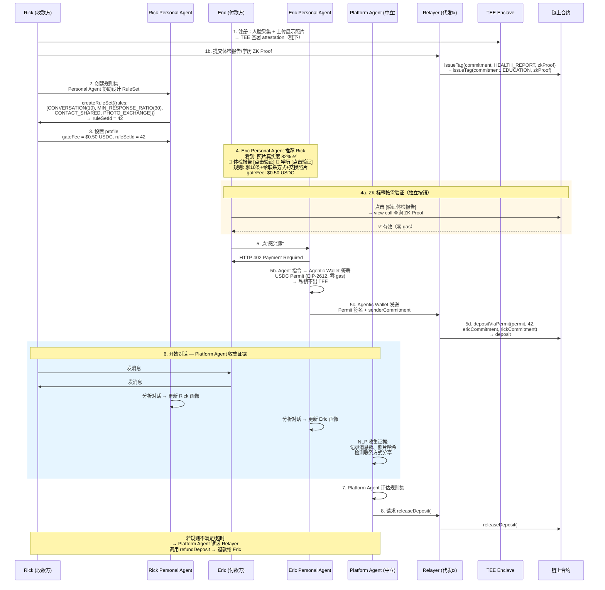

> **ZK 标签验证与"感兴趣"是独立流程：** 体检报告、学历证明等 ZK 标签显示为 Rick profile 上的独立验证按钮。Eric 可随时点击触发链上验证（view call，零 gas），验证结果实时展示在 profile 页面。这些验证与"感兴趣"（付费）是两条独立路径，互不阻塞。照片真实度是 profile 展示指标，不在任何触发路径中。

若 Rick 不回复或规则不满足 → 超时自动退款给 Eric。

### 争议升级机制

Platform Agent 自动仲裁并非终局裁决。为防止 Platform Agent 误判，系统提供三级争议解决路径：
```
Level 1: Platform Agent 自动仲裁（默认）
  · 基于规则集自动评估，90%+ 的交易在此解决
  · 如任一方不满意 → 在 48h 内调用 disputeDeposit()

Level 2: 多 Agent 复审
  · 3 个独立 Agent 重新评估同一证据集（多数票决）
  · 增加 Agent 互评机制，复审结果写入 ERC-8004 Validation Registry
  · 如仍不满意 → 提交 Level 3

Level 3: 社区仲裁 (Phase 3+)
  · 匿名仲裁员池（需质押 token 参与）
  · 仲裁员只能看到脱敏证据（消息数量、时间戳，不看内容）
  · 多数票决 + 仲裁员质押 slash 机制防止乱判
```

合约层面，PrivacyEscrow 增加 `DISPUTED` → `APPEAL` → `RESOLVED` 状态流转，Level 2/3 的仲裁结果通过多签或 DAO 投票合约 `resolveDispute()` 执行。

### 证据提交方式

| 证据类型 | 怎么提交 | 谁提交 |
|----------|---------|--------|
| 对话消息 | 自动：通过加密通信通道，Platform Agent 收集 | Platform Agent (自动) |
| 照片 | `submitPhoto(depositId, photoHash)` | 双方 (主动) |
| 内容交付 | `submitContentDelivery(depositId, contentHash)` | 接收方 |
| 线下签到 | `submitCheckin(depositId, locationHash, proofType)` | 双方 (到场时) |
| 视频通话 | Platform Agent 自动记录（通过通话服务集成） | Platform Agent (自动) |
| 服务完成 | `confirmServiceComplete(depositId)` | 双方 (各自确认) |
| 自定义证明 | `submitCustomProof(depositId, zkProof)` | 提交方 |

**场景二：匿名内容访问（x402 → Escrow）**
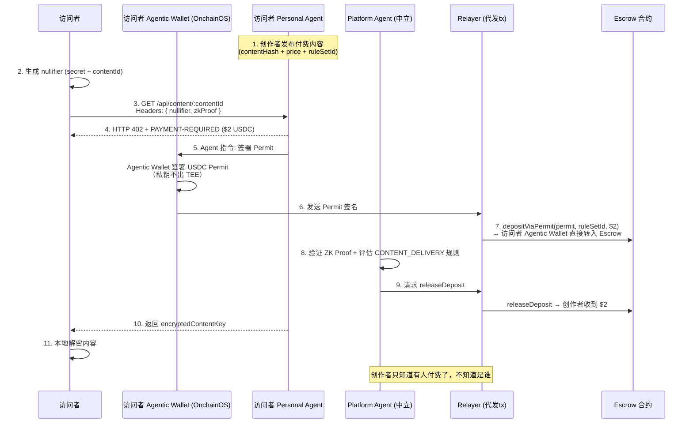

**隐私保证：**

- 创作者只能看到有人付费了，看不到是谁
- nullifier 防止同一人重复付费
- ZK Proof 证明付费者拥有有效身份，但不暴露身份
- 内容密钥用访问者的 nullifier 派生密钥加密

## 3.4 Onchain OS 集成

**集成点：**

| 功能 | Onchain OS 能力 | 说明 |
|------|---------------|------|
| Agentic Wallet | Wallet（TEE 私钥托管） | 私钥在 TEE 内生成和签名，Agent 通过 SDK 发送指令 |
| 交易执行 | Trading（OKX DEX 聚合） | 多链 swap/交易，Personal Agent 后期 DeFi 能力的基础 |
| 行情数据 | Market Data | 多链实时行情，辅助 Agent 决策 |
| Agent 支付 | Payments（x402 协议） | Agent 间 pay-per-use 支付 |
| 合约调用 | Open API | issueTag, createDeposit, releaseDeposit 等 |
| 事件监听 | Open API | 监听 DepositCreated, TagIssued 等 |
| Agent 注册 | Skills / Plugin Store | 作为 Onchain OS Agent 入驻 |

## 3.5 支付架构 — x402 入口 + Privacy Escrow 统一托管

### 核心原则：所有支付都经过 Escrow

[x402](https://www.x402.org/) 是基于 HTTP 402 状态码的链上支付协议（Coinbase + Cloudflare，2025 年上线），支持 EVM/SVM 的 stablecoin 按次付费。在本系统中，**x402 是统一的支付入口**，所有资金的目的地都是 **Privacy Escrow 合约**，由 Platform Agent（中立第三方）评估完规则后才释放。Agentic Wallet 签 Permit，Relayer 代提交链上交易。没有"即时到账"的路径。

```
所有场景的支付链路：
  用户操作 → HTTP 402 → Agentic Wallet 签 Permit（私钥不出 TEE）→ Relayer 代提交 depositViaPermit() → 资金锁入 Escrow
  → 双方交互 / Personal Agent 各自更新画像 → Platform Agent 收集证据 + 评估规则 → Relayer 代提交释放/退款
```

### 为什么统一走 Escrow

- **信任一致：** 无论 gate fee $0.50 还是线下服务 $200，收款方都必须满足规则才能拿到钱，付款方始终有退款保障
- **规则驱动：** 即使是 gate fee，也需要 CONVERSATION、CONTACT_SHARED 等有效交互规则评估通过后才释放
- **争议可仲裁：** 所有支付都有三级仲裁兜底（§3.3），不存在"付了就没了"的情况
- **隐私统一：** Escrow 合约用 commitment/nullifier 保护身份，所有支付链路享受同等隐私保护

### 各场景支付流程

| 场景 | 金额 | x402 入口 | Escrow 规则 | 释放条件 |
|------|------|----------|------------|---------|
| 交友 gate fee | $0.01-$1 | GET /api/gate/:profileId | CONVERSATION + MIN_RESPONSE_RATIO + CONTACT_SHARED | 双方聊够 + 分享联系方式 |
| 内容访问 | $0.01-$5 | GET /api/content/:contentId | CONTENT_DELIVERY | 内容成功解密交付 |
| 线下家政/代驾 | $20-$200 | POST /api/service/:providerId | OFFLINE_CHECKIN + SERVICE_COMPLETED | 到场签到 + 双方确认完成 |
| 付费咨询 | $50-$500 | POST /api/service/:providerId | VIDEO_CALL + CONTENT_DELIVERY | 视频通话完成 + 报告交付 |
| 电商信任交易 | $10-$10,000 | POST /api/service/:providerId | SERVICE_COMPLETED + CUSTOM_PROOF | 收货确认 |
| Agent-to-Agent 服务 | $0.01+ | GET /api/agent/:serviceId | CUSTOM_PROOF | 外部 Agent 提交 proof |

### x402 → Escrow 入金机制（Permit 模式）

x402 返回 402 后，由 **Agentic Wallet** 签一个 **ERC-20 Permit**（EIP-2612，链下签名，零 gas）。签名完成后，客户端将 permit 发送给**平台 Relayer**，Relayer 代提交链上交易调用 Escrow 合约的 `depositViaPermit()` — 一笔交易完成签名验证 + 拉钱 + 创建 deposit。**用户私钥始终在 Agentic Wallet 的 TEE 内，Relayer 只是签名的搬运工。**
```
流程: Agent 发指令 → Agentic Wallet 签 Permit → 发送给 Relayer → Relayer 代提交 tx

Escrow.depositViaPermit(permit, ruleSetId, senderCommitment, receiverCommitment) 内部:
  1. USDC.permit(eric, escrowAddress, amount, deadline, v, r, s)  // 验证 Eric Agentic Wallet 的链下签名
  2. USDC.transferFrom(eric, escrowAddress, amount)               // 从 Eric Agentic Wallet 拉钱到 Escrow
  3. deposits[depositId] = { amount, ruleSetId, sender, receiver, status: LOCKED }
→ 一笔 tx，资金从 Eric Agentic Wallet 直接进 Escrow 合约
→ Relayer 只付 gas，不经手资金，不持有用户私钥
```

### 完整流程（以交友 gate fee 为例）

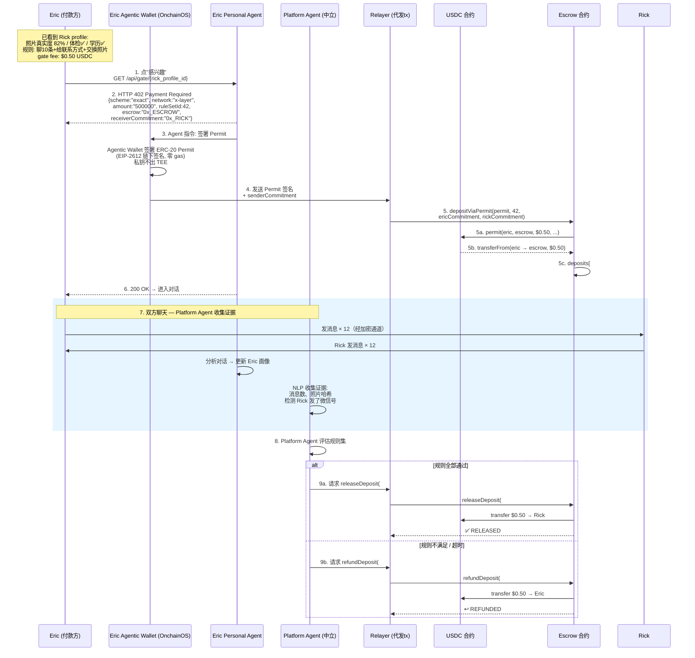

### 完整流程（以线下服务为例）

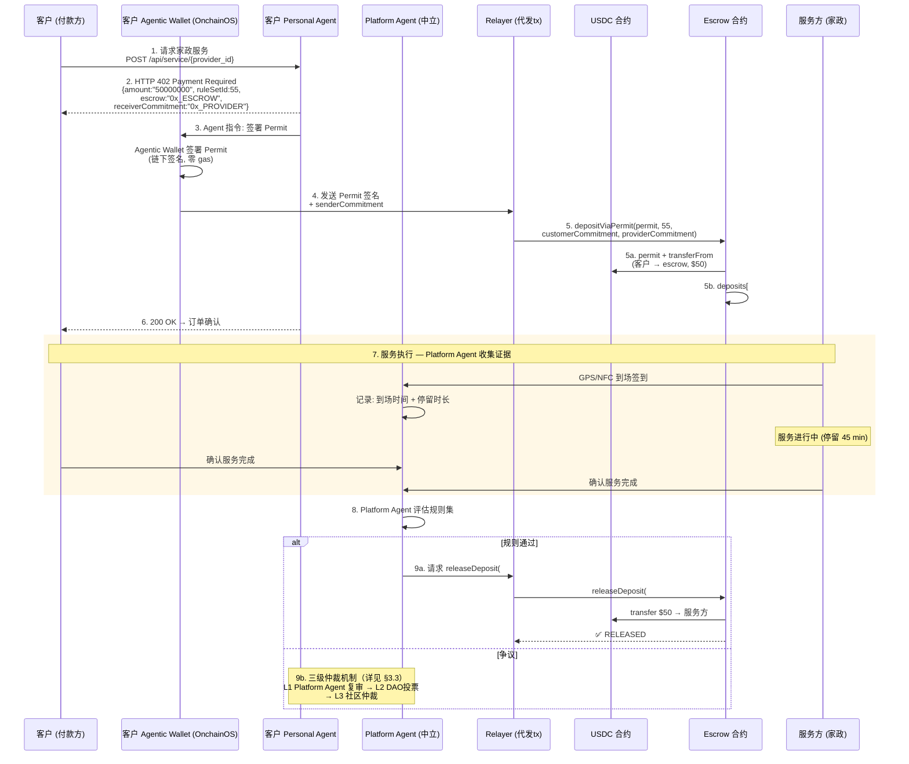

### 端到端实例 — 高端交友全链路（从注册到结算）

> **场景：** 高端交友。Rick 是收款方（设 gate fee），Eric 是付款方（点"感兴趣"）。

#### Step 1：Rick 注册 & 建立 Profile

Rick 下载 App → 系统为 Rick 创建 **Personal Agent（Rick Personal Agent）** 和 **Agentic Wallet（集成 OnchainOS）**。Personal Agent 负责对话分析和用户画像构建（后期可代理 DeFi 操作）。规则评估和仲裁由 **Platform Agent**（中立第三方）负责。Agent 可以控制 Agentic Wallet 发起链上操作，但**私钥在 Agentic Wallet 的 TEE 内生成和签名，任何人（包括 Agent、用户、平台）无法触碰**。

注册流程：TEE Enclave 采集 Rick 真人面部（活体检测），Rick 上传展示照片（可修图）。TEE 比对相似度 → 签署 attestation（链下），attestation 存储在平台后端（与用户 profile 关联），不上链。

**结果：** Rick 的 profile 上展示 **"照片真实度 82%"**（纯展示指标，不参与规则评估）。

同时 Rick 选择验证附加资质：
- 提交体检报告 → TEE 生成 DocumentVerify ZK Proof → Relayer 代提交 `issueTag(commitment, HEALTH_REPORT, zkProof)` 上链
- 提交学历证明 → 同理 ZK Proof 上链 → 绑定 EDUCATION 标签到 profile

链上只存 commitment（Poseidon hash），原始文件验完即销。

#### Step 2：Rick Personal Agent 协助设定规则 & gate fee

Rick 与 Personal Agent 交互，Agent 根据 Rick 的偏好建议规则组合。Rick 确认后创建 RuleSet：
```typescript
createRuleSet({
  rules: [
    { ruleType: CONVERSATION, paramUint: 10, required: true },      // 双方各聊≥10条
    { ruleType: MIN_RESPONSE_RATIO, paramUint: 30, required: true }, // 回复比例≥30%
    { ruleType: CONTACT_SHARED, required: true },                    // 我会给联系方式
    { ruleType: PHOTO_EXCHANGE, required: true },                    // 双方交换照片
    { ruleType: OFFLINE_AGREED, required: false },                   // 约线下（加分项）
    { ruleType: VIDEO_CALL, paramUint: 60, required: false },        // 视频通话（加分项）
  ]
}) → ruleSetId = 42
```

设 gate fee = **$0.50 USDC**，绑定 ruleSetId = 42。

> **关键设计点：** PHOTO_AUTHENTICITY 不在规则里（它是 profile 展示指标），体检/学历也不在规则里（它们是独立验证按钮）。规则只管"有效交互" — Rick 有没有在认真跟 Eric 聊。

#### Step 3：Eric Personal Agent 推荐 Rick

Eric 也有自己的 **Personal Agent** 和 **Agentic Wallet**。Eric Personal Agent 负责画像构建和推荐展示，与平台 Matchmaking Service 协同，基于 ZK 标签 + 用户画像 + 偏好匹配推荐 Rick。Eric 在推荐列表看到 Rick profile：
```
Rick, 28
📷 照片真实度 82% ✅
📎 体检报告 [点击验证]   📎 学历 [点击验证]
💬 规则: 聊10条 + 给联系方式 + 交换照片
💰 gate fee: $0.50 USDC
```

#### Step 4：Eric 按需验证 ZK 标签（可选，独立于"感兴趣"）

Eric 想确认 Rick 的体检和学历是真的：
- 点击 **[验证体检报告]** → 链上 view call 查询 Rick 的 HEALTH_REPORT ZK Proof → 返回 ✅ 有效
- 点击 **[验证学历]** → 链上 view call 查询 Rick 的 EDUCATION ZK Proof → 返回 ✅ 有效

这些是**零 gas 的链上只读查询**，跟后面的支付流程完全独立，Eric 可随时验证、不限次数。

#### Step 5：Eric 点"感兴趣" → x402 支付入口

Eric 点击"感兴趣" → Eric Personal Agent 请求 `GET /api/gate/{rick_profile_id}` → 返回 **HTTP 402 Payment Required**：
```json
{
  "scheme": "exact",
  "network": "x-layer",
  "token": "USDC",
  "maxAmountRequired": "500000",
  "escrow": "0x_ESCROW_CONTRACT",
  "ruleSetId": 42,
  "receiverCommitment": "0x_RICK_COMMITMENT"
}
```

#### Step 6：Agent → Agentic Wallet 签名 → Relayer 代提交 → 资金锁入 Escrow

Eric Personal Agent 收到 402 后，向 **Eric Agentic Wallet** 发出签名指令。Agentic Wallet 在 TEE 内签署 **ERC-20 Permit**（EIP-2612，链下签名，零 gas）。**私钥不出 TEE。** 签名后，Agentic Wallet 将 permit 发送给**平台 Relayer**。

Relayer 代提交链上交易：
```
Relayer 调用 Escrow.depositViaPermit(permit, ruleSetId=42, ericCommitment, rickCommitment)
```
合约内部一笔 tx 完成三件事：
1. `USDC.permit(eric, escrowAddress, amount, deadline, v, r, s)` — 验证 Agentic Wallet 的链下签名
2. `USDC.transferFrom(eric, escrowAddress, amount)` — 从 Eric 地址拉 $0.50 USDC 到 Escrow
3. `deposits[depositId] = { amount, ruleSetId, sender, receiver, status: LOCKED }` — 创建 deposit 记录

**Agent 控制 Wallet 但不碰私钥。Relayer 只付 gas，不经手资金。**

Eric Personal Agent 返回 200 OK → Eric 进入与 Rick 的加密对话。

#### Step 7：双方交互 — Personal Agent 更新画像，Platform Agent 收集证据

Rick 和 Eric 开始聊天（端到端加密）。**双方 Personal Agent 各自分析对话更新用户画像，Platform Agent 作为中立第三方收集交互证据**：
- Rick Personal Agent：分析对话，更新 Rick 的用户画像
- Eric Personal Agent：分析对话，更新 Eric 的用户画像
- **Platform Agent：** NLP 收集交互证据（消息数、照片哈希、联系方式检测）
- 各发了 12 条消息
- 双方交换了照片（Platform Agent 记录照片哈希）
- Rick 在对话中发了自己的微信号 → Platform Agent NLP 检测到联系方式分享
- Rick 说"周六下午三点，我们在 xxx 咖啡厅见？" → Platform Agent NLP 检测到线下见面意向

#### Step 8：Platform Agent 评估规则集 #42

**Platform Agent** 作为中立第三方，负责评估规则是否满足（避免收款方自己评判自己的利益冲突）：
```
✅ CONVERSATION:       双方各12条 >= 10         (PASS, required)
✅ MIN_RESPONSE_RATIO: 85% >= 30%               (PASS, required)
✅ CONTACT_SHARED:     Rick 发了微信号          (PASS, required)
✅ PHOTO_EXCHANGE:     双方各发了照片            (PASS, required)
✅ OFFLINE_AGREED:     约了周六见面              (PASS, bonus)
⏳ VIDEO_CALL:         未发生                    (SKIP, bonus)
→ 所有 required 规则通过 → decision: RELEASE
```

#### Step 9：Escrow 结算

Platform Agent 请求 Relayer 调用 `releaseDeposit(#N)` → Escrow 合约释放 $0.50 USDC 到 Rick 的地址。

整个过程链上只有 commitment/nullifier，外部观察者无法关联 Rick 和 Eric 的真实身份。

**如果规则不满足 / 超时（如 Rick 一直不回消息）：** Platform Agent 请求 Relayer 调用 `refundDeposit(#N)` → $0.50 退回 Eric。Escrow 合约内置 deadline，超时后 Platform Agent 自动触发退款，无需依赖任何一方主动发起。若 Eric 有争议 → 进入三级仲裁（详见争议升级机制）。

#### Step 10（可选续集）：线下约会 → 第二笔 Escrow

Rick 和 Eric 约了周六见面 → Eric 预付晚餐费 $100：
```
1. POST /api/service/{rick_id} → HTTP 402 ($100 USDC, ruleSetId=55)
2. Eric Agent → Agentic Wallet 签署 Permit → Relayer 代提交 depositViaPermit() → deposit #2 创建（LOCKED）
3. 双方到餐厅 → GPS/NFC 签到 → 停留 1.5 小时
4. Platform Agent 评估规则:
   ✅ OFFLINE_CHECKIN: 停留 90min >= 30min (PASS)
   ✅ SERVICE_COMPLETED: 双方确认见面 (PASS)
   → Platform Agent 请求 Relayer → RELEASE → Rick 收到 $100
5. 双方 P2P 互评 → 写入 ERC-8004 信誉系统（对外匿名、对内可知）
```

#### 一句话总结

> **注册建档**（每用户一个 Personal Agent + Agentic Wallet + TEE attestation + ZK Proof 上链）→ **Personal Agent 协助设规则 + gate fee** → **对方 Personal Agent 推荐匹配** → **浏览 profile**（照片真实度 + ZK 标签验证，都是付费前自行判断的）→ **点"感兴趣"触发 x402** → **Personal Agent 指令 Agentic Wallet 签 Permit（私钥不出 TEE）** → **Relayer 代提交 → 资金锁入 Escrow** → **Personal Agent 各自分析对话更新画像，Platform Agent 收集证据** → **Platform Agent（中立第三方）按规则评估"有效交互"** → **Relayer 代提交释放/退款**

### 隐私保护

Permit 模式下付款方的链上地址可见（Eric 的钱包地址出现在 `transferFrom` 中）。隐私方案：
- **付款方隐私：** Phase 3 引入 stealth address — 用户通过 ZK commitment 派生一次性支付地址，每次用不同地址签 Permit，链上无法关联多次支付到同一用户
- **收款方隐私：** Escrow 释放时通过 nullifier + ZK Proof 提取，链上无法关联存入方和提取方
- **Escrow 内部：** 合约只存 action_commitment，不存明文地址
- Phase 1 MVP 暂用明文地址 + Permit，Phase 3 接入 stealth address

### 为什么用 x402 + Permit

- **HTTP 原生：** 支付嵌在 API 调用中，402 → 签名 → 重发，前端用 `paymentFetch` 替换 `fetch` 即可
- **零 gas 签名：** Permit 是链下签名（EIP-2612），Eric 不需要发交易，Relayer 代付 gas 提交
- **TEE 私钥隔离：** 用户私钥在 Agentic Wallet 的 TEE 内生成和签名，Agent / 用户 / 平台均无法导出，Relayer 不持有私钥
- **无托管风险：** 资金从用户 Agentic Wallet 直接进 Escrow 合约，Relayer 只转发签名不经手资金
- **Stablecoin 计价：** 所有费用以 USDC 计价，避免 ETH 波动
- **AI Agent 友好：** Agent 可自主发起/接收 x402 支付（Agent-to-Agent 场景），无需人工审批
- **标准化：** 任何支持 x402 的客户端（包括其他平台的 Agent）都可直接接入

### SDK 集成
```typescript
// 服务端 —— x402 中间件 + Permit 模式
import { paymentMiddleware } from "@x402/express";
import { escrow } from "./contracts/PrivacyEscrow";

app.use(paymentMiddleware({
  "GET /api/gate/:profileId": {
    accepts: [{ network: "x-layer", token: "USDC" }],
    paymentMode: "permit",  // 使用 ERC-20 Permit 而非 facilitator 转账
  },
  "GET /api/content/:contentId": {
    accepts: [{ network: "x-layer", token: "USDC" }],
    paymentMode: "permit",
  },
  "POST /api/service/:providerId": {
    accepts: [{ network: "x-layer", token: "USDC" }],
    paymentMode: "permit",
  },
}));

// x402 收到 Permit 签名后，Relayer 代提交到 Escrow 合约
// 注意：Relayer 只用自己的 key 付 gas，不持有用户私钥
app.post("/api/gate/:profileId/settle", async (req, res) => {
  const { permit, senderCommitment } = req.body;  // permit 由 Eric Agentic Wallet 签署
  const { ruleSetId, receiverCommitment } = await getProfileRules(req.params.profileId);
  const tx = await relayer.submitTx(
    escrow.depositViaPermit,
    permit,           // Eric Agentic Wallet 的 USDC Permit 签名（Relayer 无法伪造）
    ruleSetId,        // Rick 的规则集
    senderCommitment, // Eric 的 commitment
    receiverCommitment // Rick 的 commitment
  );
  res.json({ depositId: tx.depositId, status: "LOCKED" });
});

// 客户端 —— paymentFetch 自动处理 402 → Permit 签名 → 重发
import { paymentFetch } from "@x402/fetch";
await paymentFetch(`/api/gate/${profileId}`, { wallet });
```

# 4. ZK 电路设计

## 4.0 Commitment & Nullifier 分层设计

为避免跨模块活动关联，系统采用 **两层 commitment** 架构：
```
Identity Layer（身份层，永不上链）:
  identity_secret   — 用户主密钥，本地生成并保管
  identity_nullifier — 用户身份唯一标识

  identity_commitment = Poseidon(identity_secret, identity_nullifier)
  ⚠️ identity_commitment 只在本地和 ZK 电路内部使用，不直接上链

Action Layer（行为层，每次操作独立）:
  action_commitment = Poseidon(identity_secret, domain_separator, nonce)
  action_nullifier  = Poseidon(identity_secret, action_id)

  · domain_separator 区分场景: "zk_tag" / "escrow" / "content"
  · nonce 确保同一场景下多次操作不重复
  · 链上只出现 action_commitment，观察者无法关联不同场景的操作
  · action_nullifier 用于防双花，公开后合约检查是否已使用

ZK 电路统一证明:
  "我知道一个 identity_secret，它能同时派生出链上的 action_commitment
   和本次公开的 action_nullifier，且这个 identity 满足某种属性约束"
  → 不暴露 identity_secret、identity_nullifier、也不暴露跨场景关联
```

## 4.1 FaceMatch — 纯 TEE 链下方案

### 设计原则

人脸验证**全程在 TEE 内完成，不上链**。
原因：整条链路的信任锚点就是 TEE（人脸模型推理、活体检测、embedding 提取和比对全部在 TEE 内执行）。链上验 TEE 签名不增加任何安全性——**信任边界已经在 TEE，上链是冗余的**。Phase 2 后 Platform Agent 跑在 TEE 里，仲裁时直接在 TEE 内验 attestation 即可，无需链上合约参与（Phase 1 由平台服务端验证）。
ZK 留给真正需要零信任的场景：RangeProof、DocumentVerify、Commitment/Nullifier 隐私体系。

### 数据原则

**系统不存储任何人脸信息。** 链上无人脸数据，Agent 后端无人脸数据，用户设备无人脸数据。base_embedding 仅存在 TEE enclave 加密内存中，外部不可读取。

### 核心流程

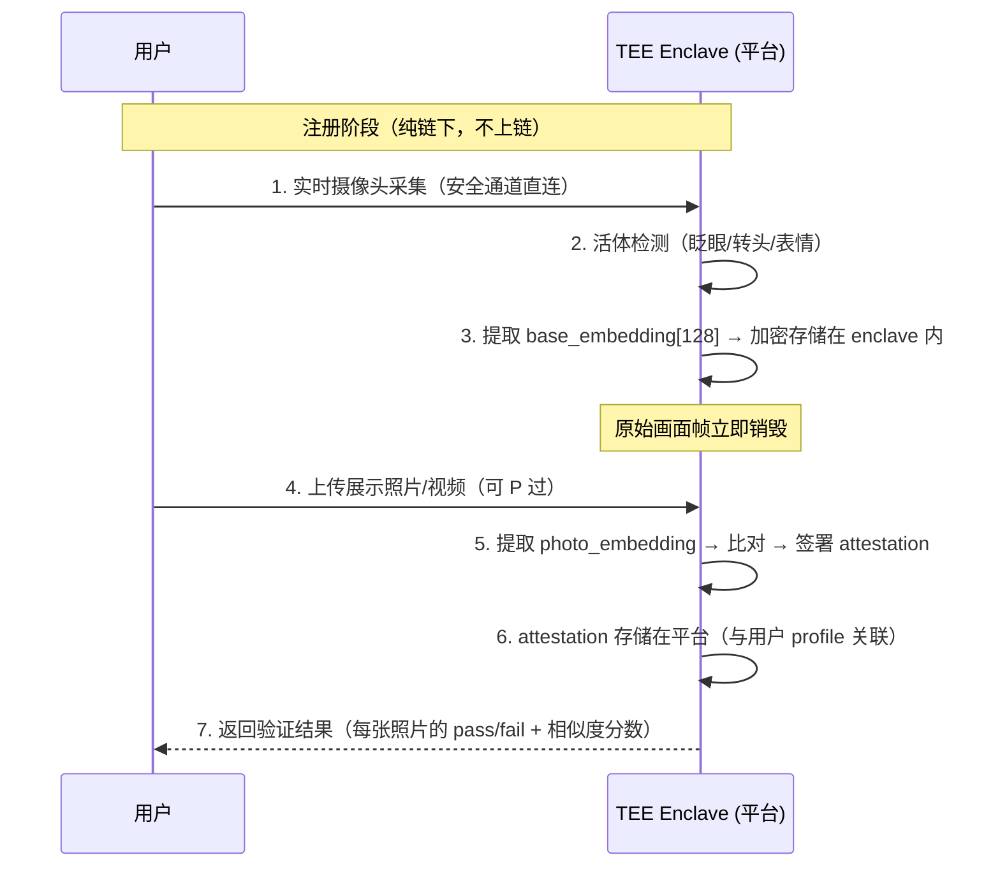

```
注册阶段详细说明:
  · 步骤 1-3 为一次性人脸采集，无需上传自拍或证件
  · 步骤 4-7 可随时重复（添加/更换展示照片），base_embedding 已在 TEE 内缓存
  · 如需更新 base_embedding（外貌变化较大）→ 重新触发步骤 1-3
  · attestation 内容: { action_commitment, photo_hash, similarity_score, timestamp, tee_sig }
  · attestation 不含任何人脸数据，仅含哈希 + 分数 + 签名
  · attestation 直接存储在平台后端，与用户 profile 关联
  · 相似度分数作为 profile 展示指标（如"照片真实度 82%"），Eric 浏览时直接可见

照片真实度的展示（非验证触发，纯展示）:
  · attestation 中的 similarity_score 直接展示在 Rick 的 profile 页面
  · Eric 浏览时看到"照片真实度 82% ✅"，自行决定是否感兴趣
  · 照片真实度不参与 Escrow 规则评估 — 这是 Eric 付费前的决策依据，不是 Agent 仲裁的标准
  · attestation 过期（如 30 天）→ profile 提示"照片验证已过期"，Rick 需重新验证才能展示分数

存储分布:
  · 链上: 无任何人脸相关数据
  · TEE enclave: base_embedding（加密内存，Agent 代码也无法直接读取）
  · 平台后端: attestation（photo_hash + score + sig，不含人脸数据）
  · 用户设备: 无
```

### 关于视频

用户也可以上传 P 过的视频作为展示素材。TEE 内部处理：抽取关键帧 → 逐帧提取 embedding → 与 base_embedding 比对 → 输出单个 attestation（取所有帧中最低相似度作为最终分数）。活体检测在注册阶段的实时摄像头采集中已完成，视频展示素材不再重复活体检测。

### 相似度阈值

| 场景 | 阈值 | 说明 |
|------|------|------|
| 身份证 vs 真人 | 0.85 | 严格匹配，几乎无编辑 |
| 真人 vs 轻度美颜 | 0.70 | 允许磨皮、美白、瘦脸等常见美颜 |
| 真人 vs 重度 P 图 | 0.55 | 允许较大修改，但仍需同一人面部结构 |
| 最低安全线 | 0.50 | 低于此值拒绝，防止冒充他人 |

相似度分数展示在 profile 上（如"照片真实度 82%"），Eric 自行判断。平台设定最低安全线 0.50，低于此值的照片不允许上传展示。

### 未来演进：Client-Side zkML（Phase 4+）

当 zkML 技术成熟后（EZKL / Modulus Labs / Risc Zero），人脸模型推理可迁入客户端 ZK 电路/zkVM，实现完全无需信任 TEE 的验证——用户本地生成 ZK proof，任何人可验证，无需信任任何第三方。届时 TEE attestation 方案可平滑退役。

## 4.2 RangeProof Circuit（范围证明）
```
输入:
  private: value                   // 实际值 (如年龄 25)
  private: identity_secret         // 用户主密钥
  private: domain_nonce            // 场景 nonce
  public:  action_commitment       // Poseidon(identity_secret, "zk_tag", domain_nonce)
  public:  action_nullifier        // Poseidon(identity_secret, action_id) — 防同一属性重复颁发
  public:  lowerBound              // 下限 (如 18)
  public:  upperBound              // 上限 (如 30)

约束:
  1. action_commitment == Poseidon(identity_secret, DOMAIN_ZK_TAG, domain_nonce)
  2. action_nullifier == Poseidon(identity_secret, action_id)
  3. value >= lowerBound           // 通过 bit decomposition 实现
  4. value <= upperBound

电路规模估算: ≈ ~1,000 约束 (Groth16 proof 生成 < 1 秒)
```

## 4.3 DocumentVerify Circuit（文档验证）

> **实现说明：** 签名验证算法选择 **EdDSA (BabyJubJub)**。EdDSA 在 Circom 中仅需 ~5,000 约束（vs ECDSA ~1,500,000 约束）。这要求颁发机构使用 EdDSA 密钥对文档签名，或由可信中间层将 ECDSA 签名转译为 EdDSA 签名。
```
输入:
  private: document_hash           // 文档内容的 Poseidon hash
  private: issuer_signature_R8[2]  // EdDSA 签名 R 点 (BabyJubJub)
  private: issuer_signature_S      // EdDSA 签名 S 值
  private: identity_secret
  private: domain_nonce
  public:  action_commitment       // Poseidon(identity_secret, "zk_tag", domain_nonce)
  public:  issuer_pubkey[2]        // 颁发机构 EdDSA 公钥 (BabyJubJub 点)

约束:
  1. action_commitment == Poseidon(identity_secret, DOMAIN_ZK_TAG, domain_nonce)
  2. EdDSAVerify(issuer_pubkey, issuer_signature, document_hash) == true
     // 使用 circomlib/circuits/eddsamimc.circom

电路规模估算:
  · EdDSA 验证 ≈ ~5,000 约束
  · Poseidon hash ≈ ~300 约束
  · 总计 ≈ ~6,000 约束 (Groth16 proof 生成 < 2 秒)
```

### 注册阶段 — 文档验证上链

Rick 在注册时一次性完成文档验证，ZK Proof 上链后标签永久绑定到她的 profile：
```
1. Rick 提交加密文档（体检报告 / 学历证明 / 收入证明）→ TEE 内解密
2. TEE 验证文档签名有效（颁发机构 EdDSA 公钥）
3. TEE 为 Rick 生成 DocumentVerify ZK Proof（Groth16, < 2 秒）
4. 调用链上合约 issueTag(action_commitment, tagType, zkProof)
5. 链上验证通过 → 标签（HEALTH_REPORT / EDUCATION 等）绑定到 Rick 的 profile
6. 标签状态在 Rick 的 profile 页面显示为 ✅ 已验证
```

### 按需验证 — Profile 独立按钮触发

ZK 标签验证是 Rick profile 上的独立按钮，与"感兴趣"（付费）是两条独立路径：
```
1. Rick 的 profile 页面展示已验证的 ZK 标签（体检报告 ✅、学历 ✅ 等）
2. 每个标签旁有 [点击验证] 按钮
3. Eric 点击某个标签的验证按钮 → 前端直接调用链上合约 view call
4. 链上验证 ZK Proof 的有效性（Groth16 verify, < 100ms, 零 gas）
5. 验证结果实时展示在 profile 页面（✅ 有效 / ❌ 无效）
6. Eric 可以在点"感兴趣"之前或之后随时验证，互不阻塞
```

**关键特性：**
- Rick 只需在注册时生成一次 ZK Proof 并上链，之后所有验证都是链上 view call（零 gas）
- ZK 标签验证与 gate fee/照片验证完全解耦 — Eric 可以先验证文档再决定是否付费
- proof 不过期，除非 Rick 主动更新文档（如新的体检报告）

# 5. ERC-8004 信任评分体系集成

## 5.1 ERC-8004 概述

[ERC-8004 (Trustless Agents)](https://eips.ethereum.org/EIPS/eip-8004) 是 2026 年 1 月上线的以太坊标准，为 AI Agent 提供链上信任基础设施。它包含三个轻量级链上注册表：

- **Identity Registry** — 基于 ERC-721 的 Agent 身份 NFT，可被跨平台发现
- **Reputation Registry** — 标准化的链上评分反馈系统（`giveFeedback` / `getSummary`）
- **Validation Registry** — 第三方验证钩子（stakers / zkML / TEE oracle 独立审核）

## 5.2 三层嵌入架构
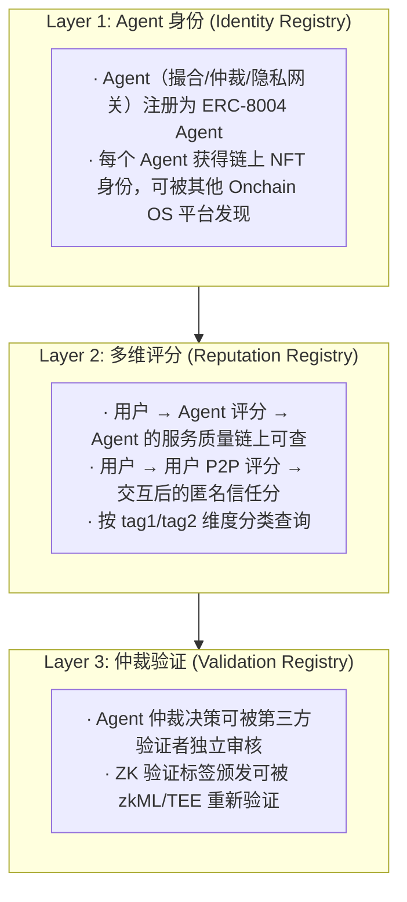

## 5.3 评分维度（tag1/tag2 编码）

ERC-8004 的 `giveFeedback` 使用 `tag1` (服务类型) + `tag2` (场景) 两个 bytes32 字段做分类：

| tag1 (服务类型) | tag2 (场景) | 含义 |
|-----------------|------------|------|
| `keccak("matchmaking")` | `keccak("dating")` | 交友撮合质量 |
| `keccak("matchmaking")` | `keccak("ecommerce")` | 电商撮合质量 |
| `keccak("arbitration")` | `keccak("gate_fee")` | gate fee 仲裁公正性 |
| `keccak("arbitration")` | `keccak("service")` | 服务仲裁公正性 |
| `keccak("content")` | `keccak("access")` | 内容访问体验 |
| `keccak("identity")` | `keccak("verification")` | 身份验证速度/体验 |
| `keccak("p2p")` | `keccak("interaction")` | 用户间交互体验（匿名 P2P 评分） |

## 5.4 评分如何影响业务

**撮合排序加权（核心）：**
匹配算法采用四因子加权（与 §3.2 一致）：
```
标签(30%) + 向量(30%) + 偏好(15%) + ERC-8004 信任分(25%)
```

信任分的加权逻辑：

- 高评分用户（200+/255）→ 匹配排序靠前
- 新用户（无评分）→ 默认中性 128/255，不惩罚
- 低评分用户（<100/255）→ 降权但不完全排除

**P2P 互评流程：**
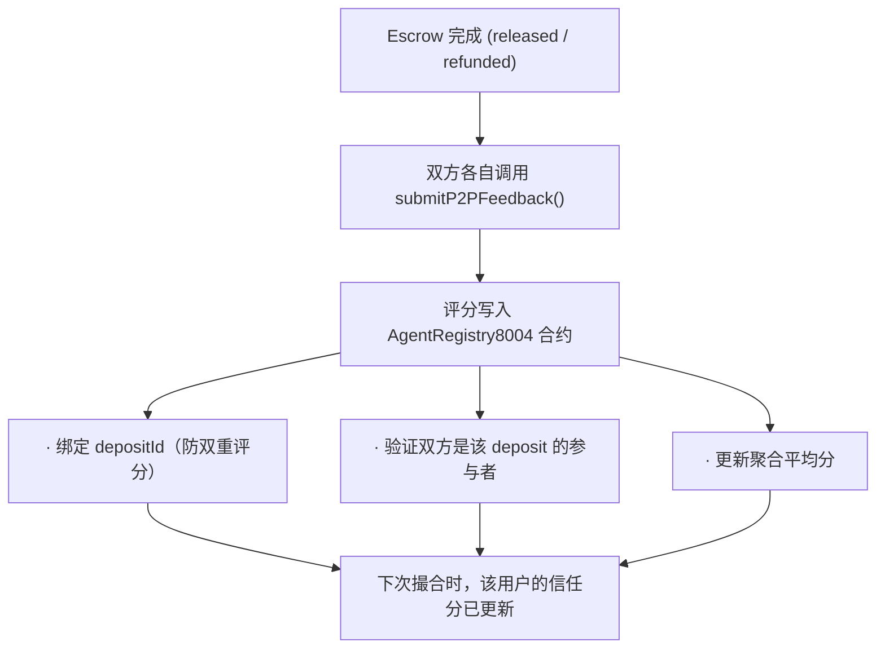

**互评匿名性说明：** P2P 互评是"对外匿名、对内可知"模型。链上观察者只能看到 commitment 之间的评分，无法反推真实身份。但交互双方自己知道对方的评分（因为一个 deposit 只有两方参与）。这是合理的设计取舍 — 评分的目的是建立信任信号，交互双方本来就知道彼此的存在。如需完全匿名评分（连对方也不知道谁打了几分），Phase 3 可引入 ZK 盲评方案（评分加密提交 → 聚合后解密，单条评分不可追溯）。

**其他影响：**

- gate fee 折扣：接收方可根据对方信任分设置差异化 gate fee
- 争议仲裁参考：评分历史作为 Agent 仲裁的辅助信号
- Agent 服务评分：用户对 Agent 的评分写入 ERC-8004 Reputation Registry，跨平台可查

## 5.5 合约：AgentRegistry8004.sol

核心合约负责：

- `registerAgent()` — 将我们的 Agent 注册到 ERC-8004
- `rateAgent()` — 用户对 Agent 评分，写入 ERC-8004 Reputation Registry
- `submitP2PFeedback()` — 用户间匿名互评（绑定 depositId + commitment）
- `getP2PScore()` — 查询用户综合信任分
- `getP2PScoreByTag()` — 按维度查询信任分

# 6. 数据流 & 隐私模型

## 6.1 数据存储原则

| 数据类型 | 存储位置 | 加密方式 | 生命周期 |
|----------|----------|----------|----------|
| 原始摄像头画面 | **不存储** | — | TEE 内处理完毕后立即销毁 |
| 原始证件/文档 | **不存储** | — | 验证后立即销毁 |
| base_embedding (人脸) | **仅 TEE enclave 加密内存** | TEE 硬件加密 | 用户主动更新前有效，外部不可读取 |
| TEE attestation (人脸) | 平台后端 | 明文（仅含 photo_hash + score + sig，不含人脸） | 与用户 profile 关联，按需验证时 TEE 直接读取 |
| Identity Commitment | **不上链**（仅本地 + ZK 电路内部） | Poseidon hash | 用户自管，永久 |
| Action Commitment | 链上（按需写入） | Poseidon hash | 永久（每次操作独立派生，不可跨场景关联） |
| Action Nullifier | 链上 | Poseidon hash | 永久（防双花，公开后合约标记已使用） |
| ZK Tag | 链上 | Hash | 有过期时间 |
| 用户画像向量 | Agent 内存 | AES-256 | 会话期间 |
| 对话记录 | Agent 内存 | Hash only | 仲裁完成后销毁 |

## 6.2 安全假设

安全模型按阶段递进，MVP 与生产环境的信任假设不同：
**关键不变量（所有阶段）：**
- **用户私钥始终在 TEE 内：** 用户的私钥在任何阶段都只存在于 Agentic Wallet 的 TEE 内，Agent 可控制 Wallet 发起操作但不碰私钥，Relayer 不持有私钥。所有链上签名由 Agentic Wallet 完成。
- **Relayer 不经手资金：** Relayer 只代提交交易（付 gas），无法伪造用户签名，无法挪用资金。

**MVP 阶段（Phase 1）— 半信任模型：**

1. **Personal Agent 半可信：** 每个用户的 Personal Agent 运行在普通服务器，能看到对话内容（用于画像构建）。隐私保证依赖运营方信誉 + 数据"验证后立即销毁"的承诺。
2. **Platform Agent 半可信：** Platform Agent 运行在普通服务器，能看到对话内容（用于 NLP 证据收集和规则评估）。作为中立第三方，避免收款方自评的利益冲突，但 Phase 1 其公正性依赖运营方信誉。
3. **FaceMatch 降级方案：** Phase 1 无 TEE 环境，人脸比对在平台服务器内执行（模型推理 + embedding 比对），attestation 由平台服务端密钥签名（非 TEE 硬件签名）。安全性依赖运营方信誉，Phase 2 切换到 TEE 后平滑升级为硬件签名。
4. **ZK 证明在平台侧生成：** MVP 阶段 proof 由平台生成（用户提交原始数据），仅保证链上隐私，不保证对平台的隐私。
4. **链上不可篡改：** 验证标签和 Escrow 状态由链上合约保证。
5. **ZK Soundness：** ZK 证明的 soundness 由 Groth16 保证。
6. **Relayer 单点：** Phase 1 Relayer 由平台运营，存在单点故障风险。Phase 3 计划引入去中心化 Relayer 网络。

**Phase 2 — TEE 半信任模型：**

1. **Platform Agent 运行在 TEE：** FaceMatch、attestation 签名、embedding 存储、规则评估全部迁入 TEE enclave，Agent 代码本身也无法读取用户明文人脸数据。
2. **Relayer 密钥在 TEE 内生成：** Relayer 的 gas 支付密钥在 TEE 内生成且不可提取，确保 Relayer 只能按规则提交交易（注意：这是 Relayer 的操作密钥，不是用户私钥）。
3. **ZK 证明仍在 Agent 侧生成：** 但 Agent 运行在 TEE 内，原始数据不出 enclave。

**目标架构（Phase 4+）— 最小信任模型（零信任）：**

1. **Agent 运行在 TEE：** Intel SGX / AWS Nitro Enclave，Agent 自身也无法读取用户明文数据。
2. **ZK 证明在客户端生成：** 用户本地运行 circom/snarkjs，Agent 只做链上验证，永远不接触原始数据。
3. **密钥分层管理：** identity_secret 完全由用户本地保管，平台无法获取或恢复。Agentic Wallet 私钥始终在 TEE 内。
4. **去中心化 Relayer：** 多个独立 Relayer 竞争提交交易，消除单点故障。
5. **第三方可审核：** 仲裁决策可通过 ERC-8004 Validation Registry 被独立验证者重新审核。

# 7. 技术选型

| 组件 | 技术 | 理由 |
|------|------|------|
| 智能合约 | Solidity + Foundry | 行业标准，Foundry 开发效率高 |
| ZK 框架 | Circom / snarkjs | 成熟的 ZK 工具链，社区活跃 |
| Agent | Node.js + TypeScript | 与 Onchain OS 生态一致 |
| 支付通道 | x402 (@x402/express + @x402/fetch) | HTTP 原生按次付费，支持 stablecoin 微支付 |
| AI 模型 | OpenAI Embeddings / 本地模型 | 用户画像生成 + 对话质量评估 |
| 链 | X Layer (OKX L2) | 低 Gas + OKX 生态原生 |
| 前端 | React + Vite + @x402/fetch | 轻量快速，x402 支付无缝集成 |

# 8. API 设计

## 8.1 身份验证
```
POST /api/verify
Body: {
  actionCommitment: string,       // Poseidon(identity_secret, "zk_tag", nonce)
  verifyType: "identity" | "health" | "age_range" | ...,
  documents: [{ docType, encryptedData, zkCircuitId }],
  cameraSessionId?: string   // 实时摄像头采集的 TEE 会话 ID（人脸验证用）
}
Response: { success, actionCommitment, tagHash, error? }
```

## 8.2 仲裁规则（用户自定义）
```
POST /api/rules/create
Body: {
  actionCommitment: string,       // 规则创建者的 action_commitment
  description: "聊5条+交换照片",
  rules: [
    { ruleType: "CONVERSATION", paramUint: 5, required: true },
    { ruleType: "PHOTO_EXCHANGE", required: true },
    { ruleType: "VIDEO_CALL", paramUint: 60, required: false }
  ]
}
Response: { ruleSetId: number }

GET /api/rules/:ruleSetId
Response: { ruleSetId, description, rules: [...] }
```

## 8.3 匹配
```
POST /api/match/register
Body: {
  actionCommitment: string,       // Poseidon(identity_secret, "matchmaking", nonce)
  scenario: "dating" | "ecommerce" | ...,
  requiredTags: string[],
  preferences: {},
  gateFee?: string,
  ruleSetId?: number              // 绑定仲裁规则集
}

GET /api/match/results?actionCommitment=0x...
Response: [{ matchId, partnerActionCommitment, score, requiresPayment, gateFee?, ruleSetId?, ruleDescription? }]
```

## 8.4 隐私支付（x402 → Escrow）

所有支付统一通过 x402 入口。Personal Agent 指令 Agentic Wallet 签署 USDC Permit（私钥不出 TEE），Relayer 代提交 Escrow.depositViaPermit() 一笔交易完成入金。Platform Agent 负责后续规则评估。
```
GET /api/gate/:profileId                ← x402 保护
→ 无支付: 返回 HTTP 402 + PAYMENT-REQUIRED（gateFee USDC, escrow, ruleSetId）
→ 有支付: Agentic Wallet 签 Permit → Relayer 代提交
  → Relayer 调用 Escrow.depositViaPermit(permit, ruleSetId, commitments)
  → 资金从 Eric Agentic Wallet 转入 Escrow → 返回 { depositId, status: "LOCKED" }

POST /api/service/:providerId           ← x402 保护（大额服务）
→ 同上流程，金额由服务方设定

GET /api/payment/status/:depositId
Response: { depositId, amount, status, ruleSetId, evaluations?: [...], createdAt, deadline }

POST /api/payment/dispute/:depositId    ← 争议发起
Body: { actionCommitment, reason }
Response: { disputeId, level: 1|2|3, status }
```

## 8.5 证据提交
```
POST /api/evidence/photo
Body: { depositId, actionCommitment, photoHash }

POST /api/evidence/checkin
Body: { depositId, actionCommitment, locationHash, proofType: "gps"|"nfc"|"qrcode" }

POST /api/evidence/confirm
Body: { depositId, actionCommitment }

POST /api/evidence/content
Body: { depositId, contentHash }
```

## 8.6 匿名内容（x402 → Escrow）
```
POST /api/content/publish
Body: { creatorActionCommitment, contentHash, price, ruleSetId }
Response: { contentId }

GET /api/content/access/:contentId   ← x402 入口
Headers: { nullifier, zkProof }
→ 无支付: 返回 HTTP 402 + PAYMENT-REQUIRED（price USDC, receiver: Escrow）
→ 有支付: Agentic Wallet 签 Permit → Relayer 代提交 Escrow.depositViaPermit() 锁入资金
  → Platform Agent 评估 CONTENT_DELIVERY 规则
  → 通过: Relayer 代提交 releaseDeposit → 创作者收款 + 返回 { encryptedContentKey }
  → 争议: 进入三级仲裁
```

# 9. 部署架构
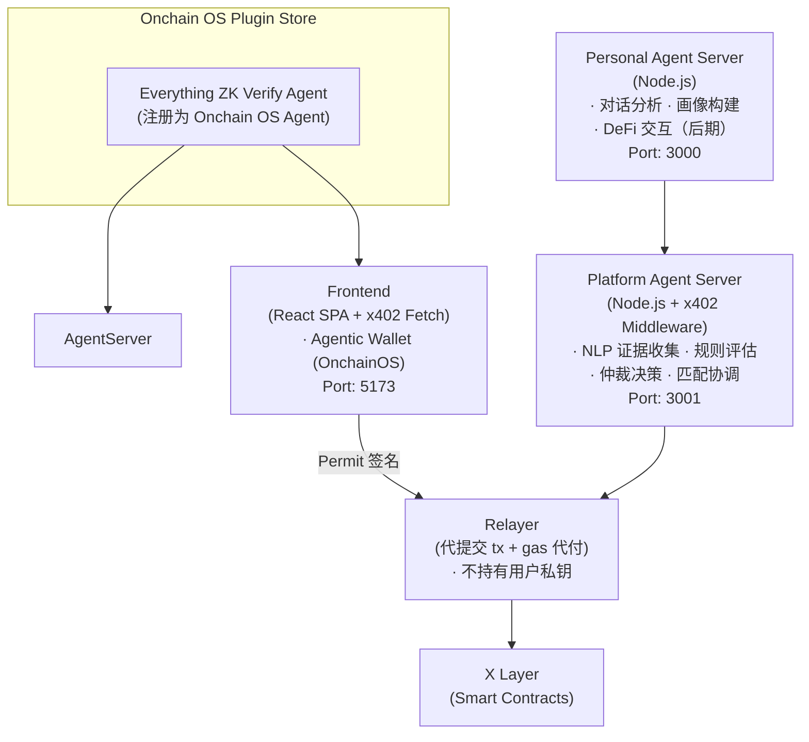

# 10. 开发路线图

## Phase 1 — MVP (黑客松提交)

- [x] 合约骨架 (ZKVerifyRegistry, PrivacyEscrow + 规则系统, AnonymousContentAccess)
- [x] Agent 服务骨架 (Matchmaking, Arbitration 规则评估引擎, Privacy Gateway)
- [x] SDK 骨架（含规则创建 + 证据提交 API）
- [x] 用户自定义仲裁规则系统（10种规则类型，可组合）
- [ ] Agentic Wallet SDK 集成（OnchainOS）
- [ ] Personal Agent 服务（对话分析 + 画像构建）
- [ ] Platform Agent 服务（NLP 证据收集 + 规则评估 + 仲裁）
- [ ] Agent ↔ Agentic Wallet 交互协议（signPermit 指令）
- [ ] 集成 Onchain OS SDK
- [ ] 集成 x402 支付通道（@x402/express 中间件 + @x402/fetch 客户端）
- [ ] 交友 gate fee 完整流程 Demo（含自定义规则 + x402 支付）
- [ ] 线下服务签到流程 Demo
- [ ] 录屏 / 在线 Demo

## Phase 2 — TEE + ZK 实现

- [ ] Platform Agent 迁入 TEE（规则评估 + 仲裁在 TEE 内执行）
- [ ] TEE FaceMatch 流程（人脸模型推理 + 活体检测 + attestation 签名，链上只验签）
- [ ] PHOTO_AUTHENTICITY profile 展示 + attestation 过期刷新机制
- [ ] 实现 RangeProof ZK 电路（Circom）
- [ ] 实现 DocumentVerify ZK 电路（EdDSA/BabyJubJub）
- [ ] 链上 TEE 签名验证器 + ZK verifier 部署

## Phase 3 — AI Agent 增强

- [ ] Platform Agent 对话质量 AI 评估（CONVERSATION 规则辅助判断）
- [ ] Personal Agent 用户画像 embedding 生成模型
- [ ] Personal Agent DeFi 代理能力（买 meme、swap、流动性操作）
- [ ] 社交信号分析器
- [ ] 去中心化 Relayer 网络

## Phase 4 — 生产化

- [ ] TEE 生产化部署（Intel SGX / AWS Nitro Enclave）
- [ ] Client-Side zkML 探索（人脸模型推理迁入 ZK 电路/zkVM，替代 TEE attestation）
- [ ] 多链支持
- [ ] Plugin Store 正式上线
- [ ] 安全审计

# 11. 竞争优势

| 维度 | 我们的方案 | 传统方案 |
|------|-----------|----------|
| 身份验证 | ZK Proof，链上不存任何明文 | KYC 服务商存储全部个人信息 |
| 匹配隐私 | 匹配基于 commitment，双方不知真实身份 | 平台掌握全部用户数据 |
| 支付隐私 | Nullifier + ZK，创作者不知访问者 | 支付记录完全透明 |
| 仲裁机制 | 用户自定义规则 + AI Agent 自动评估，支持线上/线下多场景 | 平台硬编码规则 or 人工客服仲裁 |
| 数据主权 | 用户自持 secret，平台无法关联身份 | 平台拥有所有数据 |
